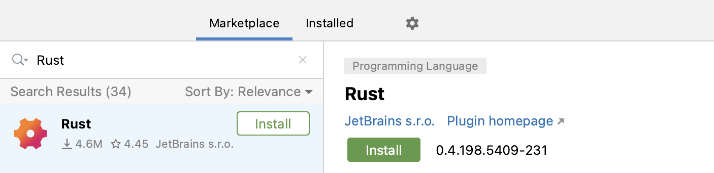

# 00-Rust安装与环境配置

## Rust安装

Rust官方推荐使用Rustup的方式来安装。

### MacOS和Linux

执行下面的命令：

```shell
$ curl --proto '=https' --tlsv1.2 https://sh.rustup.rs -sSf | sh
```

在下面的提示时，直接输出Enter确认即可。

```shell
1) Proceed with installation (default)
2) Customize installation
3) Cancel installation
>
```

安装成功后，将会看到提示：

```shell
Rust is installed now. Great!
```

这时需要重启shell或者执行`source "$HOME/.cargo/env"`来配置PATH路径。

### Windows

参考  https://www.rust-lang.org/zh-CN/tools/install 

## 更新与卸载

通过rustup的方式安装后，执行下面的命令进行更新

```shell
$ rustup update
```

如果需要卸载：

```shell
$ rustup self uninstall
```

## 检查是否安装成功

```shell
$ rustc --version
rustc 1.71.0 (8ede3aae2 2023-07-12)
```

## 配置开发环境

使用CLion + Rust Plugin或者IntelliJ IDEA + Rust Plugin，当然如果使用GoLand + Rust Plugin也是可以的。

在`Settings`-->`Plugins`-->`Marketplace`中搜索Rust，安装，按提示重启IDE即可。


